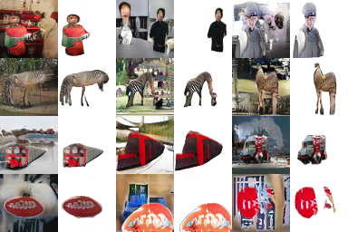
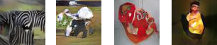
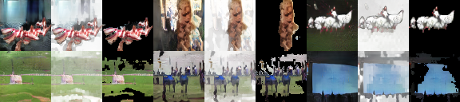
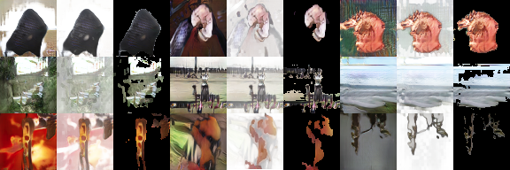

# Thesis: Image synthesis by focusing on objects.

This repository contains the last version of my [thesis](./thesis.pdf).

It also contains the majority of the code used to produce the results. The code is located in the [src](./src) folder. This code is a modification of "[Improved Training of Wasserstein GANs](https://github.com/igul222/improved_wgan_training)".

**This thesis is in Spanish.**

## Abstract

Deep convolutional neural networks have demonstrated to be very effective in learning complex concepts with images and have played and excellent role in difficult tasks such as object recognition. In recent times, a new type of network called "[Generative Adversarial Network](https://arxiv.org/abs/1406.2661)" (GAN) has appeared. This new type of network is very useful for image synthesis.

Based on studies demonstrating the [importance of motion in shape and pattern recognition](https://journals.sagepub.com/doi/10.1111/j.1467-9280.2009.02471.x) that defines a given object in a scene, our proposal is to extract the [information given by motion between consecutive frames in a video](https://people.eecs.berkeley.edu/~pathak/unsupervised_video/) and use it in the training dataset images.

The provided information from automatic motion analysis between two consecutive frames is the semantic segmentation between background and objects moving in the foreground of a given scene. Out of this segmentation, we make focus on the objects in the foreground and we insert this data as an extra channel in every training image. Given that automatic motion analysis does not produce perfect segmentation between background and moving objects, we also train the network against a dataset containing high quality segmentations done by humans.

The purpose of this work is to improve image synthesis in networks trained with high variability datasets by using the information obtained from the semantic segmentation of an image. To be able to compare if we get better results with the extra information, we also train the model without the additional channel.

Results suggest that the new channel improves the image synthesis, but this improvement is bound to the semantic segmentation quality.

## Conclusion

In this thesis we used unsupervised Deep Wasserstein Generative Adversarial Networks (WGANs) for studying the influence of the information given by semantic segmentation between background and objects in the foreground on the learning capacity of high level features using high variability datasets, with the intention of improving image synthesis quality.

The network was trained with almost perfect segmentations, focusing only one object in the scene (COCO dataset) and with imprecise segmentations, focusing one or more objects in the scene (YFCC100m dataset). In the latter, we have two versions, one with all the images (1618792) and the other one with images filtered by neural network trained on ImageNet over 1000 classes (leaving only 207103).

Results suggest that the new channel makes a significant contribution to the learning capacity of high level features. Images obtained from COCO dataset with four channels produced images that seems to fairly preserve shape and pose of learnt classes. Furthermore, segmentation quality imply to be of great importance, given that the results produced by YFCC100m dataset (whether filtered or not) shape and pose are not well-defined and is difficult to assign a particular result to a specific category.

It is clear that the results obtained with COCO dataset (with the extra channel containing semantic segmentation) are far better than all the others (including filtered YFC100m and COCO with standard RGB channels). This improvement is not reflected in inception scores. We found two possible explanations to this. On the one hand, human evaluation might be biased by what is expected to be produced by the network, knowing the parameters and data used for the tests. On the other hand, it is known that inception score is not a perfect way to measure objectively the generated images quality. We discuss inception score problems in section 2.4.

## Selected Results

### COCO - 4 channels

### COCO - 3 channels

### YFCC100m Filtered - 4 channels

### YFCC100m - 4 channels

